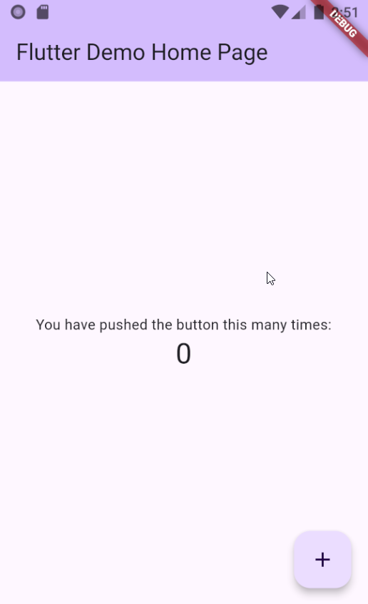

# Flutter

We hebben nu onze eerste flutter project aangemaakt. Laten we gaan kijken naar de code. 


```dart
import 'package:flutter/material.dart';

void main() {
  runApp(const MyApp());
}
```

Dit is het startpunt van onze applicatie. We zeggen hier tegen Dart, ik wil dat je de applicatie gaat opstarten. 


---
---

```dart
class MyApp extends StatelessWidget {
  const MyApp({super.key});

  @override
  Widget build(BuildContext context) {
    return MaterialApp(
      title: 'Flutter Demo',
      theme: ThemeData(
        colorScheme: ColorScheme.fromSeed(seedColor: Colors.deepPurple),
      ),
      home: const MyHomePage(title: 'Flutter Demo Home Page'),
    );
  }
}
```
Hiet is het begin van onze (mobiele) applicatie. 
We vertellen de applicatie dat het een *'material'* applicatie is. Dat betekent dat het gebruik maakt van (google) Material Design. Dit is een ontwerp iets van Google. 
We geven de Material App een titel en een colorscheme. 

---
---


```dart
class MyHomePage extends StatefulWidget {
  const MyHomePage({super.key, required this.title});

  final String title;

  @override
  State<MyHomePage> createState() => _MyHomePageState();
}
```
Hier wordt een stateful widget aangemaakt. Een stateful widget is een widget met een state (net zoals bij React). Dit is een widget die veranderingen kan ondergaan tijdens zijn levensduur. Denk hierbij aan een teller, inputveld of netwerk data dat later binnen komt.
De tweede regel is de constructor voor de widget. 

De laatste regel geeft aan bij welke State deze widget hoort.

---

```dart
class _MyHomePageState extends State<MyHomePage> {
  int _counter = 0;

  void _incrementCounter() {
    setState(() {
      _counter++;
    });
  }

  @override
  Widget build(BuildContext context) {
    return Scaffold(
      appBar: AppBar(
        backgroundColor: Theme.of(context).colorScheme.inversePrimary,
        title: Text(widget.title),
      ),
      body: Center(
        child: Column(
          mainAxisAlignment: MainAxisAlignment.center,
          children: <Widget>[
            const Text('You have pushed the button this many times:'),
            Text(
              '$_counter',
              style: Theme.of(context).textTheme.headlineMedium,
            ),
          ],
        ),
      ),
      floatingActionButton: FloatingActionButton(
        onPressed: _incrementCounter,
        tooltip: 'Increment',
        child: const Icon(Icons.add),
      ),
    );
  }
}

```

Hier gebeurt een heleboel. De counter is vanzelfsprekend. Maar vooral de functie `Widget build(Buildcontext context)` is interessant. In de **build** functie wordt hetgene dat gerendert wordt gebouwt. We bouwen een widget die door flutter getekent wordt.



## Scaffold
De scaffold (ookwel *steiger*) is een goed begin voor het begin van een applicatie. Dit is een widget met 3 eigenschappen die gelijk gebruikt worden:
* Appbar
  De bar boven in de app. Ideaal voor titels of knoppen ofzo. 
* Body
  Het hoofdgedeelte van de applicatie.
* FloatingActionButton
  Een extra popup knop.

[Volgend hoofdstuk: Flutter documentatie](3documentatie)