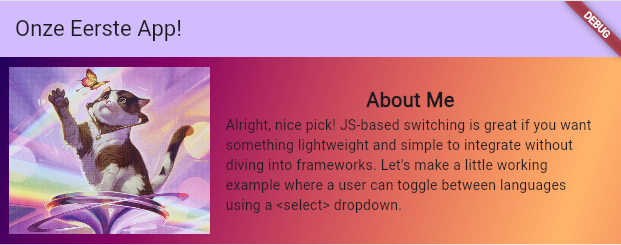

# Layouts en Widgets
Vorige les hebben we eenvoudige widgets gebruikt om tekst te centreren. Nu gaan we echt beginnen met onze eigen app te bouwen.
We gaan dezelfde app bouwen die we ook in React hebben gebouwd, alleen dan in Flutter.


Hier zien we de about me. Een leuke introductie tot layouts in flutter.
* **Layout**    
    We gaan elementen naast elkaar en onder elkaar plaasen.
* **Afbeeldingen**    
    Er komt een afbeelding op onze app.
* **Style**    
    De text en de achtergrond wordt gestijlt.


## Startpunt
main.dart
{: .code-label }
```dart
import 'package:basis/aboutme.dart';
import 'package:flutter/material.dart';

void main() {
  runApp(const MyApp());
}

class MyApp extends StatelessWidget {
  const MyApp({super.key});

  @override
  Widget build(BuildContext context) {
    return MaterialApp(
      title: 'Flutter Demo',
      theme: ThemeData(
        colorScheme: ColorScheme.fromSeed(seedColor: Colors.deepPurple),
      ),
      home: const MyHomePage(title: 'Onze Eerste App!'),
    );
  }
}

class MyHomePage extends StatelessWidget {
  const MyHomePage({super.key, required this.title});

  final String title;

  @override
  Widget build(BuildContext context) {
        return Scaffold(
            appBar: AppBar(
                backgroundColor: Theme.of(context).colorScheme.inversePrimary,
                title: Text(title),
            ),
            body: Center(
                child: Column(children: [])
            ),
        );
    }
}
```

## About Me Widget

[Volgend hoofdstuk: React project aanmaken](2dart)