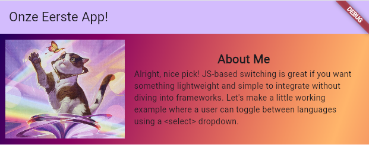

# Eerste Widget
We gaan onze eerste widget maken, en het wordt weer een 'AboutMe' widget. 


## Stap 1: Lege widget
We maken eerst een nieuw bestand aan genaamd `AboutMe.dart`, dit zetten we naast de `main.dart` in de **lib** map.
```dart
import 'package:flutter/material.dart';

class AboutMe extends StatelessWidget {
  const AboutMe({super.key});

  @override
  Widget build(BuildContext context) {
    return Container(
        child: Text("About Me!")
    );
```
Zet deze widget maar in de column in `main.dart`.

## Stap 2: Layout
De Column widget is een widget die een **List** van widgets gebruikt als children.
De Column zet allerlei widgets onder elkaar. Vergelijkbaar is de Row Widget. Deze zet widgets naast elkaar. 
Met deze twee widgets kunnen we onze *AboutMe* widget maken.

De afbeelding en de text staan naast elkaar. Deze staan dus in een **Row**. De titel en het paragraaf staan onder elkaar, deze staan dus in een *Column*.

### Stap 2a: Row
Vervang `Text` widget met een `Row` widget.

```dart
child: Row(children:[]),
```

### Stap 2b: Image
<iframe width="600" height="400" src="https://www.youtube.com/watch?v=7oIAs-0G4mw" frameborder="0"></iframe>

De `Image` widget gebruiken we voor afbeeldingen. De Image kunnen we op verschillende manieren aanmaken. Zet een image in de **Row**.

### Stap 2c: Text
De text widgets staan boven elkaar. Probeer zelf uit te zoeken hoe je de twee teksten onder elkaar krijgt, maar *naast* de afbeelding. 
*tip: Gebruik de eerder gemaakte `Row`.

## Stap 3: Styling
Met het **padding** widget kan je padding geven aan jouw elementen.
```dart
child: Padding(
  padding: EdgeInsets.all(16.0),
  child: Text("Hello world")
)
```

Met **expanded** geef je aan hoeveel ruimte van de column of row een element mag nemen. Dit werkt hetzelfde als het 'flex' eigenschap van een flexbox of de *fr* waarde in een grid template.

```dart
child: Column(
  children:[
    Expanded(
      flex: 1,
      child: Text("Hello")
    ),
    Expanded(
      flex: 2,
      child: Text("Hello")
    ),
    Expanded(
      flex: 1,
      child: Text("Hello")
    )
  ]
)
```

### Opdracht: Stylen
Ga jouw `AboutMe` component stylen.

---

[Volgend hoofdstuk: Parameters](3parameters)
